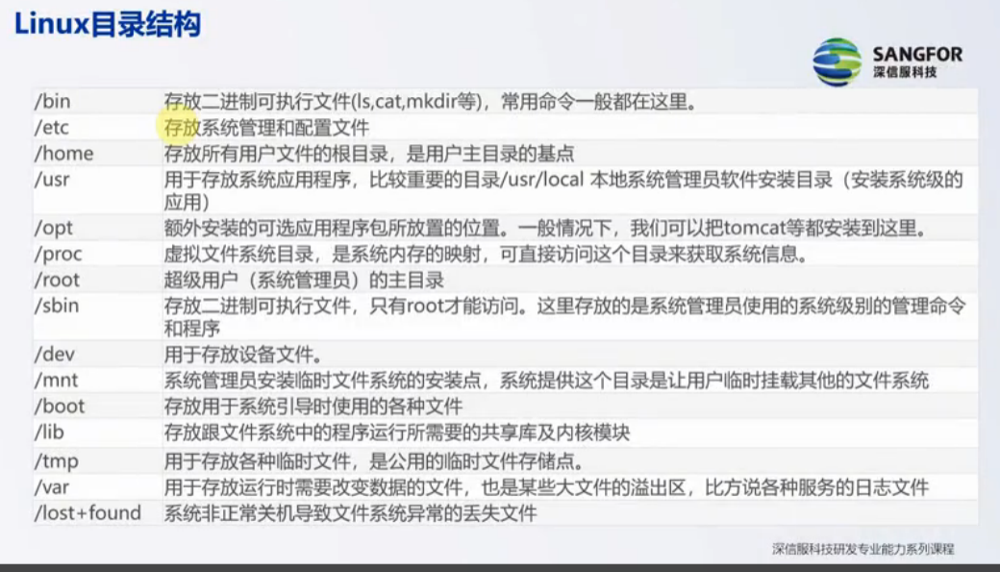

## Linux 设计哲学
- 一切皆文件
- 功能单一性
- 连接程序：把单一的程序连接成复杂的程序
- 避免交互性
- 配置管理文本化：直接修改配置文件即可

## Linux 构成

- 内核
  - 进程调度：管理CPU资源
  - 内存管理
  - 虚拟文件系统
  - 网络接口
  - 进程通信

- Shell 外壳：命令解析器

- 实用工具

## Linux 目录结构

- /bin : 